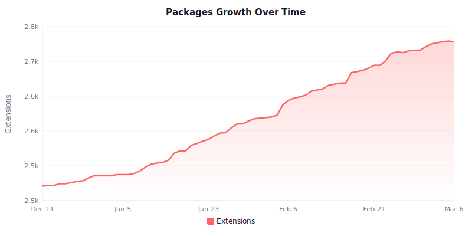
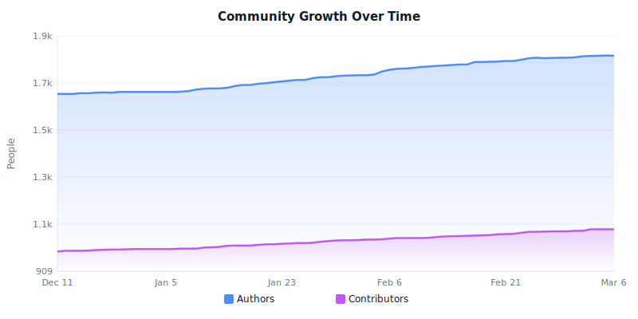
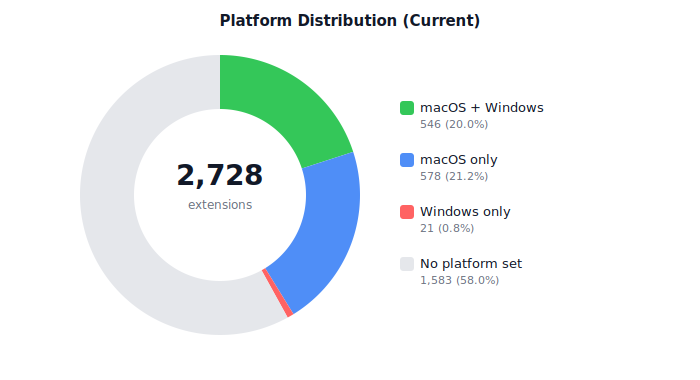
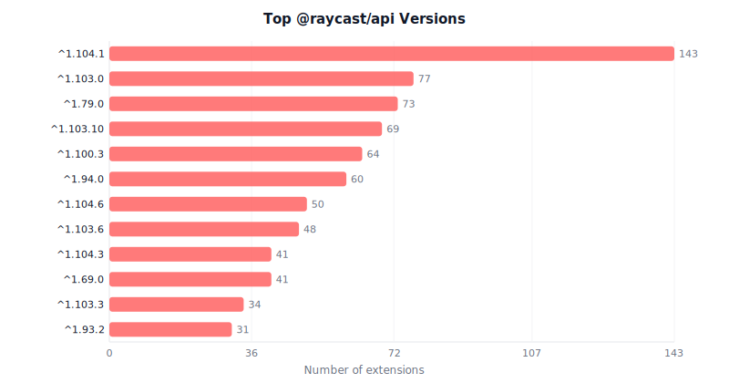

# awesome-raycast

<!-- START UPDATETIME -->

<!-- END UPDATETIME -->
Awesome Raycast is an automated list of all the extensions that are available for [Raycast](https://raycast.com). You can find these in the [Raycast Store](https://www.raycast.com/store) as well.

> This list is generated automatically every night, by a GitHub Action that scans the [Raycast Extensions Repository](https://github.com/raycast/extensions).

<!-- START GRAPHS -->

<!-- END GRAPHS -->

## Table of Contents

<!-- START TABLE_OF_CONTENTS -->
- [Statistics](#statistics)
- [Categories](#categories)
  - [Applications](docs/applications.md)
  - [Communication](docs/communication.md)
  - [Data](docs/data.md)
  - [Design Tools](docs/design-tools.md)
  - [Developer Tools](docs/developer-tools.md)
  - [Documentation](docs/documentation.md)
  - [Finance](docs/finance.md)
  - [Fun](docs/fun.md)
  - [Media](docs/media.md)
  - [News](docs/news.md)
  - [Other](docs/other.md)
  - [Productivity](docs/productivity.md)
  - [Security](docs/security.md)
  - [System](docs/system.md)
  - [Web](docs/web.md)
  - [Uncategorized](docs/uncategorized.md)
- [License](#license)
<!-- END TABLE_OF_CONTENTS -->

## Statistics

**[`^        back to top        ^`](#awesome-raycast)**

<!-- START STATISTICS -->

- **2728** packages in **15** categories, **28** packages use Swift
- **1771** authors, **1076** contributors (of which **819** are only contributors, not authors)
- **7679** total commands (5246 view, 2207 no-view, 226 menu-bar)
- **739** AI tools
- **1583** packages have no platform selected (58.03%, macOS only)
- **578** packages have macOS only (21.19%)
- **567** packages have Windows (20.78%), of which **21** packages have Windows only (0.77%)
- Top **10** authors:
  - [xmok](https://raycast.com/xmok) (110)
  - [koinzhang](https://raycast.com/koinzhang) (50)
  - [pernielsentikaer](https://raycast.com/pernielsentikaer) (21)
  - [thomas](https://raycast.com/thomas) (19)
  - [EvanZhouDev](https://raycast.com/EvanZhouDev) (18)
  - [Aayush9029](https://raycast.com/Aayush9029) (16)
  - [Visual-Studio-Coder](https://raycast.com/Visual-Studio-Coder) (16)
  - [vimtor](https://raycast.com/vimtor) (15)
  - [peduarte](https://raycast.com/peduarte) (14)
  - [tonka3000](https://raycast.com/tonka3000) (14)
- Top **10** contributors:
  - [pernielsentikaer](https://raycast.com/pernielsentikaer) (256)
  - [xmok](https://raycast.com/xmok) (194)
  - [ridemountainpig](https://raycast.com/ridemountainpig) (114)
  - [j3lte](https://raycast.com/j3lte) (57)
  - [xilopaint](https://raycast.com/xilopaint) (39)
  - [0xdhrv](https://raycast.com/0xdhrv) (34)
  - [litomore](https://raycast.com/litomore) (34)
  - [stelo](https://raycast.com/stelo) (25)
  - [thomas](https://raycast.com/thomas) (19)
  - [yusifaliyevpro](https://raycast.com/yusifaliyevpro) (15)

<!-- END STATISTICS -->

## License

**[`^        back to top        ^`](#awesome-raycast)**

This list is under the [Creative Commons Attribution-ShareAlike 3.0 Unported](https://github.com/j3lte/awesome-raycast/blob/master/LICENSE) License.
Terms of the license are summarized [here](https://creativecommons.org/licenses/by-sa/3.0/).
