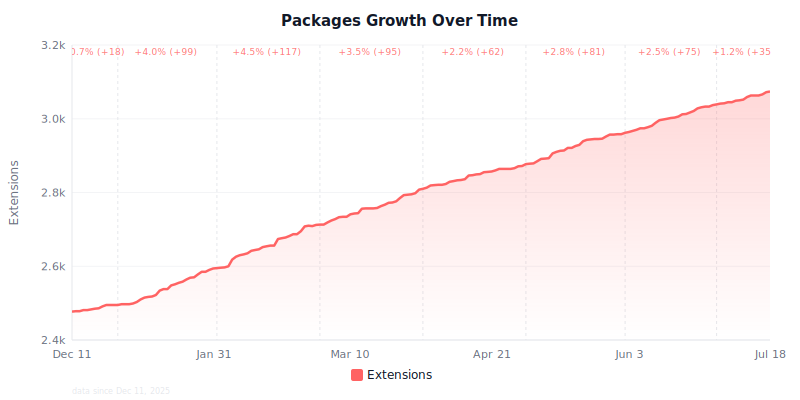
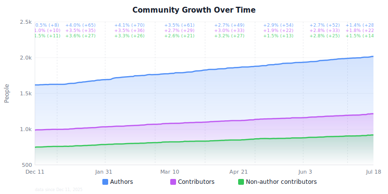
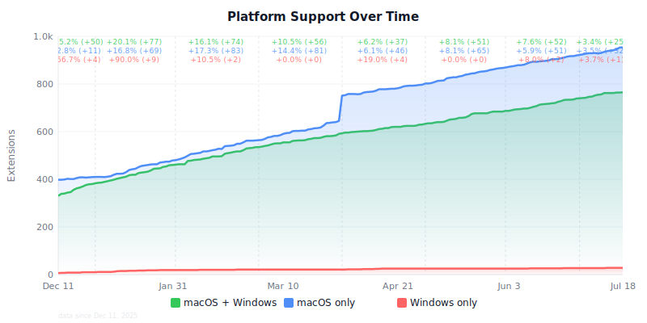
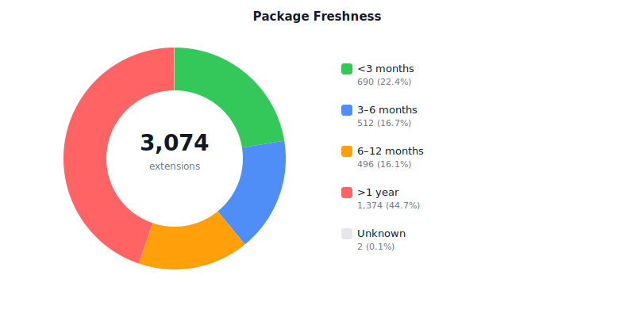
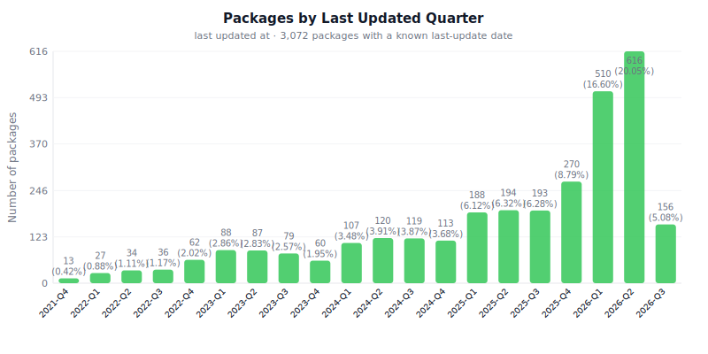
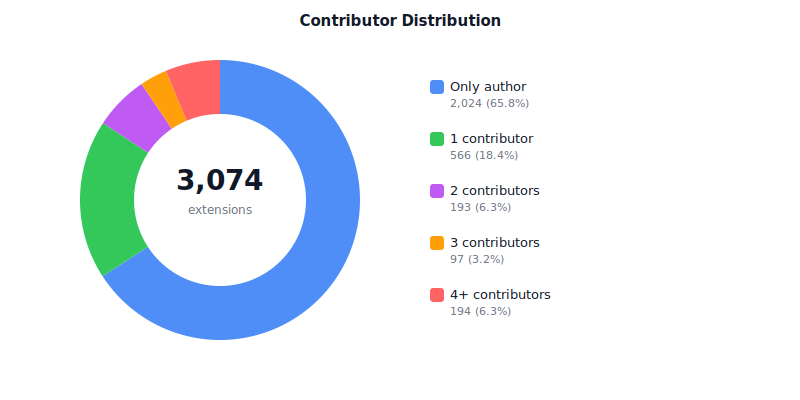
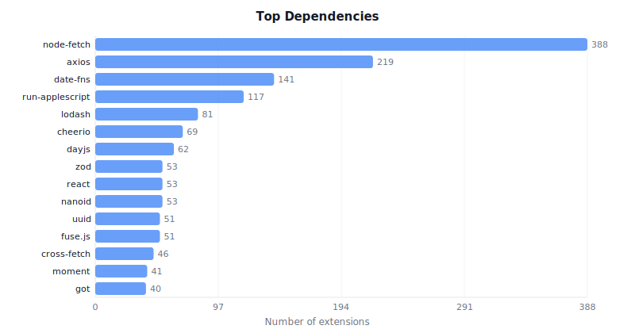
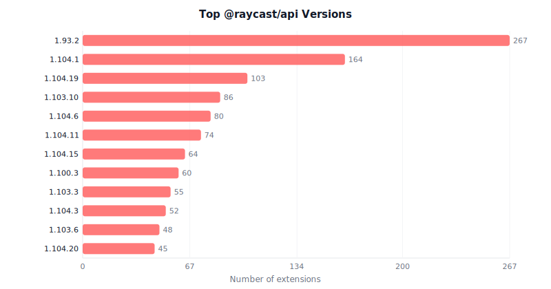
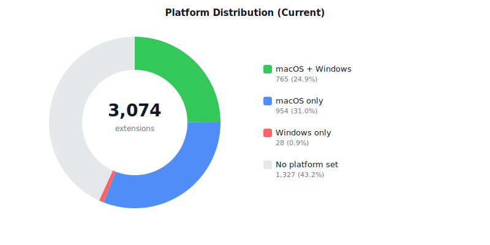

# Awesome Raycast

<!-- START UPDATETIME -->
&nbsp;
<!-- END UPDATETIME -->
Awesome Raycast is an automated list of all the extensions that are available for [Raycast](https://raycast.com). You can find these in the [Raycast Store](https://www.raycast.com/store) as well.

> **Disclaimer**: This project is not affiliated with, endorsed by, or officially connected to [Raycast Technologies Inc.](https://www.raycast.com/terms-of-service) in any way. "Raycast" is a trademark of Raycast Technologies Inc., who retain all rights to the Raycast name, logo, and associated intellectual property. This is an independent community resource.

> This list is generated automatically every night, by a GitHub Action that scans the [Raycast Extensions Repository](https://github.com/raycast/extensions).

<!-- START GRAPHS -->
## Graphs

 
 
 
 
 
 
 
 
 

<!-- END GRAPHS -->

## Table of Contents

<!-- START TABLE_OF_CONTENTS -->
- [Statistics](#statistics)
- [Categories](#categories)
  - [Applications](docs/applications.md)
  - [Communication](docs/communication.md)
  - [Data](docs/data.md)
  - [Design Tools](docs/design-tools.md)
  - [Developer Tools](docs/developer-tools.md)
  - [Documentation](docs/documentation.md)
  - [Finance](docs/finance.md)
  - [Fun](docs/fun.md)
  - [Media](docs/media.md)
  - [News](docs/news.md)
  - [Other](docs/other.md)
  - [Productivity](docs/productivity.md)
  - [Security](docs/security.md)
  - [System](docs/system.md)
  - [Web](docs/web.md)
  - [Uncategorized](docs/uncategorized.md)
- [License](#license)
<!-- END TABLE_OF_CONTENTS -->

## Statistics

**[`^        back to top        ^`](#awesome-raycast)**

<!-- START STATISTICS -->

- **3074** packages in **15** categories, **36** packages use Swift
- **2017** authors, **1215** contributors (of which **918** are only contributors, not authors)
- **9254** total commands (6303 view, 2668 no-view, 283 menu-bar)
- **1114** AI tools
- **1327** packages have no platform selected (43.17%, macOS only)
- **954** packages have macOS only (31.03%)
- **793** packages have Windows (25.8%), of which **28** packages have Windows only (0.91%)
- Top **10** authors:
  - [xmok](https://raycast.com/xmok) (111)
  - [koinzhang](https://raycast.com/koinzhang) (50)
  - [pernielsentikaer](https://raycast.com/pernielsentikaer) (21)
  - [EvanZhouDev](https://raycast.com/EvanZhouDev) (19)
  - [thomas](https://raycast.com/thomas) (19)
  - [Aayush9029](https://raycast.com/Aayush9029) (16)
  - [alexi.build](https://raycast.com/alexi.build) (16)
  - [Visual-Studio-Coder](https://raycast.com/Visual-Studio-Coder) (16)
  - [ridemountainpig](https://raycast.com/ridemountainpig) (15)
  - [vimtor](https://raycast.com/vimtor) (15)
- Top **10** contributors:
  - [pernielsentikaer](https://raycast.com/pernielsentikaer) (270)
  - [xmok](https://raycast.com/xmok) (202)
  - [ridemountainpig](https://raycast.com/ridemountainpig) (127)
  - [0xdhrv](https://raycast.com/0xdhrv) (64)
  - [j3lte](https://raycast.com/j3lte) (58)
  - [xilopaint](https://raycast.com/xilopaint) (39)
  - [litomore](https://raycast.com/litomore) (34)
  - [alexi.build](https://raycast.com/alexi.build) (27)
  - [stelo](https://raycast.com/stelo) (25)
  - [thomas](https://raycast.com/thomas) (19)

<!-- END STATISTICS -->

## License

**[`^        back to top        ^`](#awesome-raycast)**

This list is released under the [MIT License](https://github.com/j3lte/awesome-raycast/blob/master/LICENSE).
